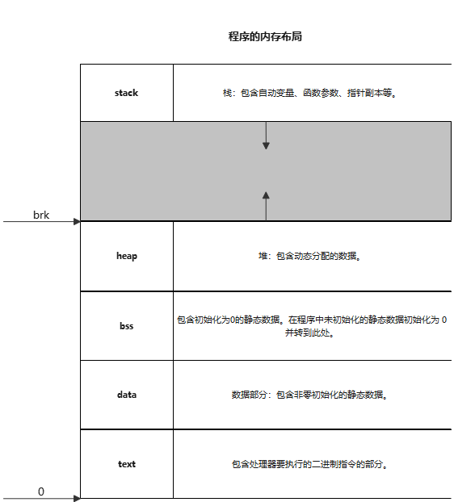

# malloc calloc realloc 重写 

程序内存布局

## 

sbrk 是一个在早期 UNIX 系统中用于扩展或缩小进程堆空间的系统调用。它接受一个整数参数，表示要调整的堆的大小，返回一个指向原先堆顶的指针。通常，sbrk 用于在运行时动态分配内存。

在 Linux 中，sbrk 的使用已经被废弃，而使用 brk 或更先进的 mmap 来实现内存分配。

这里只是练习使用